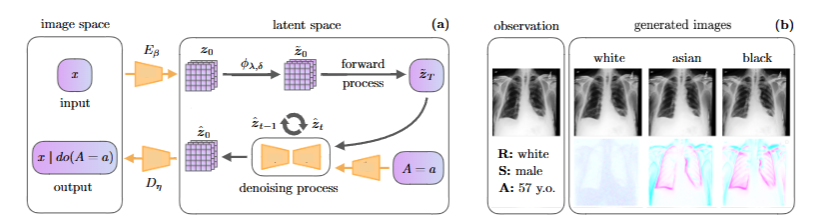
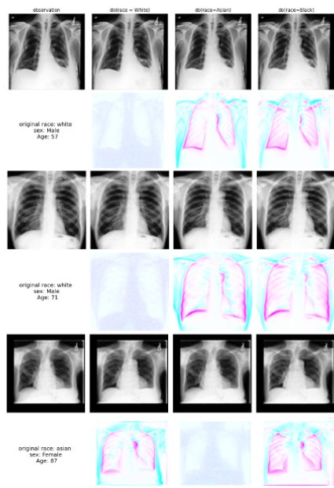

AI Alignment in Medical Imaging: Unveiling Hidden Biases Through Counterfactual Analysis
=============

*Figure: Architecture of DLDM*

The project is built with these pytorch libraries:
1. [Pytorch](https://pytorch.org/) - PyTorch + CUDA
2. [Pytorch-Lightning](https://lightning.ai/docs/pytorch/stable/) - pytorch lightning training/inference framework
3. [Scikit-learn]() - Statistical learning models

Install Environment
=============
python -m pip install -r requirements.txt

Get Started 
=============

1 Prepare Data
-------------

* TO run the experiments, you need to download the open datasets ([CheXpert: Chest X-rays](https://stanfordaimi.azurewebsites.net/datasets/8cbd9ed4-2eb9-4565-affc-111cf4f7ebe2)) and [MIMIC-CXR](https://physionet.org/content/mimic-cxr-jpg/2.1.0/). You could also create your own datasets with similar structure.

2 Train the first-stage autoencoder
----------------
* Execute [train_latent_embedder_2d.py](train_embedder.py) to build the latent embedder.
Note: In the training script, you need to reset the directory pointer to the place you put your dataset. If the the code is run on LINUX, switch to LINUX=True.

3 Train Diffusion + disentangling module
----------------
* Execute [train_ldm.py](train_ldm.py) to train the latent diffusion model. 
* Execute [train_disentangler.py](train_disentangler.py) to train the disentangler (with the loaded latent diffusion model).

4. Generation of Counterfactual images
----------------
* Execute [sample_ctf.py](sample_ctf.py) to generate the counterfactual images.

Acknowledgment 
=============
* Code builds upon https://github.com/[anonymous]

Visualizations of some counterfactual images
=============
 
*Figure: Generated Counterfactual image samples for the testing*